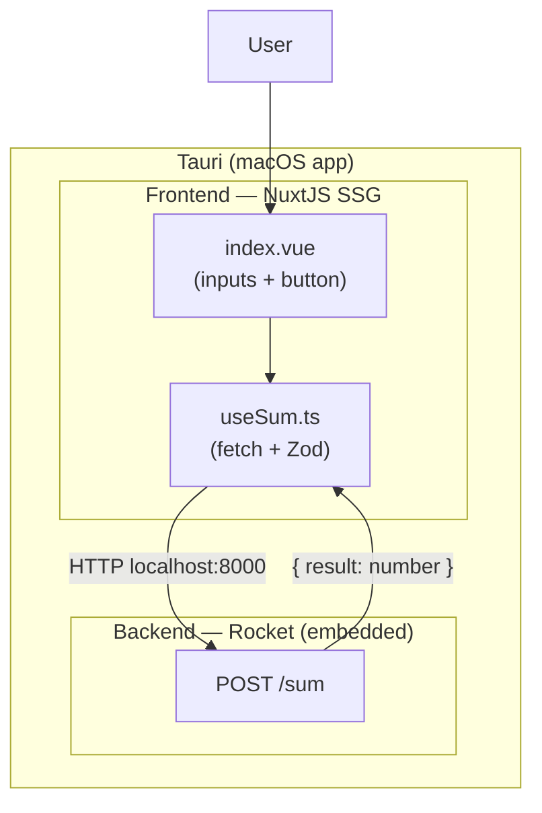

# app-demo

A macOS demo application that packages a **NuxtJS** frontend and a **Rocket** backend into a native app using **Tauri**.

The interface takes two integers, sends them to the backend, and displays the sum.

## Architecture



The Rocket backend runs in a thread inside the Tauri process. It starts automatically when the app starts — no sidecar, no separate binary.

## Requirements

- [Rust](https://rustup.rs/)
- [Node.js](https://nodejs.org/) ≥ 20
- [Task](https://taskfile.dev/) (`brew install go-task`)

## Available tasks

| Command | Description |
|---|---|
| `task install` | Install all dependencies (frontend + root) |
| `task up` | Launch the full app in dev mode — alias for `task dev` |
| `task dev` | Launch the full app in dev mode (hot-reload Nuxt + embedded Rocket) |
| `task lint` | Check the code (TypeScript + clippy) |
| `task test` | Run all tests (frontend + backend in parallel) |
| `task stop` | Stop all running processes (`task down` is an alias) |
| `task package` | Generate the static frontend, build the app, and produce the `.app` and `.dmg` |
| `task clean` | Remove all build artifacts (`.nuxt`, `target`, `node_modules`) |

### Typical workflow

```bash
# Start the full app in dev mode (frontend hot-reload + Rocket backend)
task up

# Stop everything
task stop

# Run tests
task test

# Build the distributable DMG
task package
# Output: src-tauri/target/release/bundle/dmg/app-demo_*.dmg
```

> The Rocket backend only runs inside the Tauri process. There is no standalone backend server.
> `task up` and `task dev` are aliases — both start `npx tauri dev`.

## Changing the icon

Replace the source file:

```
src-tauri/icons/app-icon.png   ← only file to edit (PNG, 1024×1024)
```

Then regenerate all icon formats:

```bash
task icons
```

This overwrites the icons used by Tauri (`32x32.png`, `128x128.png`, `icon.icns`, `icon.ico`, …).

## Changing the app name

Three places to update:

| File | Key |
|---|---|
| [src-tauri/tauri.conf.json](src-tauri/tauri.conf.json) | `productName` and `app > windows[0] > title` |
| [src-tauri/tauri.conf.json](src-tauri/tauri.conf.json) | `identifier` (e.g. `com.mycompany.myapp`) |
| [src-tauri/Cargo.toml](src-tauri/Cargo.toml) | `[package] name` |

## macOS: "app-demo is damaged and can't be opened"

This warning comes from **macOS Gatekeeper**, not from the app itself. Gatekeeper blocks any application that is not signed with an Apple Developer certificate ($99/year). When you download the `.dmg` from the internet, your browser adds a quarantine flag to the file, and macOS refuses to open it.

The app works perfectly fine — it is just not code-signed.

To fix it, open a terminal and run:

```bash
xattr -cr /Applications/app-demo.app
```

Then open the app normally. You only need to do this once.
