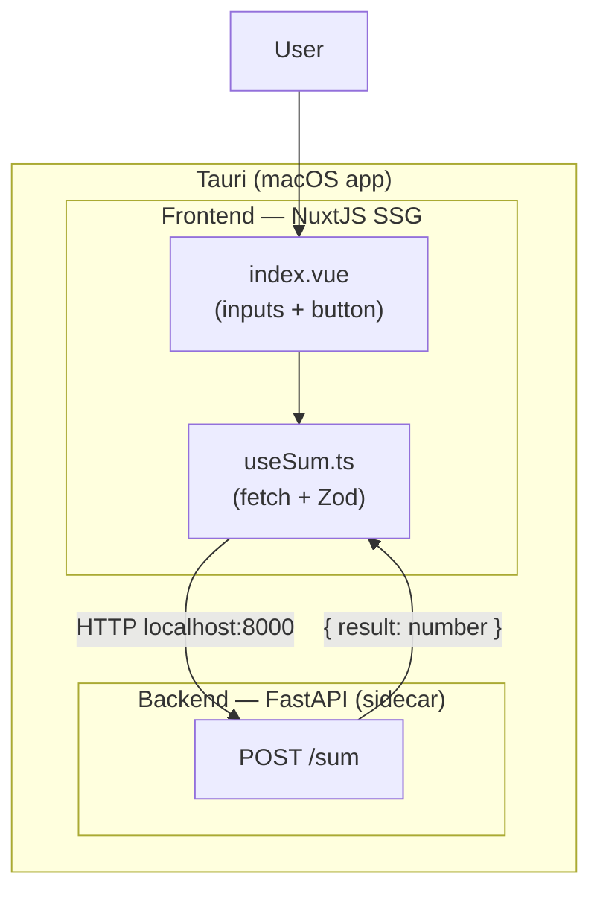

# app-demo

A macOS demo application that packages a **NuxtJS** frontend and a **FastAPI** backend into a native app using **Tauri**.

The interface takes two integers, sends them to the backend, and displays the sum.

## Architecture



The FastAPI backend is compiled into a standalone binary with PyInstaller and embedded as a **Tauri sidecar**: it starts automatically with the app and stops when the app closes.

## Requirements

- [Rust](https://rustup.rs/)
- [Node.js](https://nodejs.org/) ≥ 20
- [uv](https://docs.astral.sh/uv/) (Python package manager)
- [Task](https://taskfile.dev/) (`brew install go-task`)

## Available tasks

| Command | Description |
|---|---|
| `task install` | Install all dependencies (frontend + backend + root) |
| `task up` | Start the frontend (`:3000`) and the backend (`:8000`) in parallel |
| `task dev` | Run the Tauri app in dev mode with hot-reload |
| `task lint` | Check the code (TypeScript + ruff) |
| `task stop` | Stop all running servers (`task down` is an alias) |
| `task package` | Build the backend binary, generate the static frontend, and produce the `.app` and `.dmg` |
| `task clean` | Remove all build artifacts (`.venv`, `.nuxt`, `target`, `node_modules`, sidecar) |

### Typical workflow

```bash
# Work on frontend and backend independently
task up

# Run the full app in Tauri with hot-reload
task dev

# Stop everything
task stop

# Build the distributable DMG
task package
# Output: src-tauri/target/release/bundle/dmg/app-demo_*.dmg
```

> **`task dev` vs `task up`**
> - `task up` starts the frontend and backend as two independent servers. Useful for fast iteration without Tauri.
> - `task dev` runs `npx tauri dev`: Tauri starts the FastAPI sidecar and opens a webview pointed at the Nuxt dev server.

## Changing the icon

Replace the source file:

```
src-tauri/icons/app-icon.png   ← only file to edit (PNG, 1024×1024)
```

Then regenerate all icon formats:

```bash
task icons
```

This overwrites the icons used by Tauri (`32x32.png`, `128x128.png`, `icon.icns`, `icon.ico`, …).

## Changing the app name

Three places to update:

| File | Key |
|---|---|
| [src-tauri/tauri.conf.json](src-tauri/tauri.conf.json) | `productName` and `app > windows[0] > title` |
| [src-tauri/tauri.conf.json](src-tauri/tauri.conf.json) | `identifier` (e.g. `com.mycompany.myapp`) |
| [src-tauri/Cargo.toml](src-tauri/Cargo.toml) | `[package] name` |

## macOS: "app-demo is damaged and can't be opened"

This warning comes from **macOS Gatekeeper**, not from the app itself. Gatekeeper blocks any application that is not signed with an Apple Developer certificate ($99/year). When you download the `.dmg` from the internet, your browser adds a quarantine flag to the file, and macOS refuses to open it.

The app works perfectly fine — it is just not code-signed.

To fix it, open a terminal and run:

```bash
xattr -cr /Applications/app-demo.app
```

Then open the app normally. You only need to do this once.
